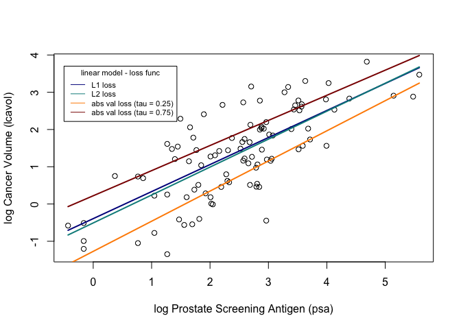
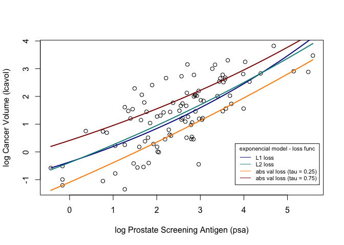

Homework 1
================
Stojsin, Rastko
January 20, 2020

``` r
library('ElemStatLearn')

## load prostate data
data("prostate")
```

``` r
## subset to training examples
prostate_train <- subset(prostate, train=TRUE)
```

``` r
## L1 loss function
L1_loss <- function(y, yhat, tau)
  abs(y - yhat)

## L2 loss function
L2_loss <- function(y, yhat, tau)
  (y - yhat) ^ 2

## Tileted absolute loss function
tilted_loss <- function(y, yhat, tau)
  ifelse(y > yhat, tau * (y - yhat), (tau - 1) * (y - yhat))
```

``` r
## fit simple linear model using numerical optimization
fit_lin <- function(y, x, loss=L2_loss, beta_init = c(-0.51, 0.75), tau) {
  err <- function(beta,t=tau){
    mean(loss(y,yhat=beta[1] + beta[2]*x,t))}
  beta <- optim(par = beta_init, fn = err)
  return(beta)
}
## fit exponencial non-linear model using numerical optimization
fit_exp <- function(y, x, loss=L2_loss, beta_init = c(-1.0, 0.0, -0.3), tau) {
  err <- function(beta,t=tau){
    mean(loss(y,yhat= (beta[1] + beta[2]*exp(-beta[3]*x)), t))}
  beta <- optim(par = beta_init, fn = err)
  return(beta)
}


## make predictions from linear model
predict_lin <- function(x, beta)
  beta[1] + beta[2]*x
## make predictions from linear model
predict_exp <- function(x, beta)
  (beta[1] + beta[2]*exp(-beta[3]*x))
```

``` r
## fit linear model
lin_beta_L1 <- fit_lin(y=prostate_train$lcavol,
                    x=prostate_train$lpsa,
                    loss=L1_loss, tau = 0)

lin_beta_L2 <- fit_lin(y=prostate_train$lcavol,
                    x=prostate_train$lpsa,
                    loss=L2_loss, tau = 0)

lin_beta_tilt <- function(tau) {
  fit_lin(y=prostate_train$lcavol,
          x=prostate_train$lpsa,
          loss=tilted_loss, tau = tau) }

## fit exponencial model
exp_beta_L1 <- fit_exp(y=prostate_train$lcavol,
                    x=prostate_train$lpsa,
                    loss=L1_loss, tau = 0)

exp_beta_L2 <- fit_exp(y=prostate_train$lcavol,
                    x=prostate_train$lpsa,
                    loss=L2_loss, tau = 0)

exp_beta_tilt <- function(tau) {
  fit_exp(y=prostate_train$lcavol,
          x=prostate_train$lpsa,
          loss=tilted_loss, tau = tau) }
```

``` r
## Linear model grid generation
## compute predictions for a grid of inputs
lin_grid <- seq(min(prostate_train$lpsa),
              max(prostate_train$lpsa),
              length.out=100)
lin_pred_L1 <- predict_lin(x=lin_grid, beta=lin_beta_L1$par)
lin_pred_L2 <- predict_lin(x=lin_grid, beta=lin_beta_L2$par)
lin_pred_tilted_0.25 <- predict_lin(x=lin_grid, beta=lin_beta_tilt(tau = 0.25)$par)
lin_pred_tilted_0.75 <- predict_lin(x=lin_grid, beta=lin_beta_tilt(tau = 0.75)$par)

## Exponencial non-linear model grid generation
## compute predictions for a grid of inputs
exp_grid <- seq(min(prostate_train$lpsa),
              max(prostate_train$lpsa),
              length.out=100)
exp_pred_L1 <- predict_exp(x=exp_grid, beta=exp_beta_L1$par)
exp_pred_L2 <- predict_exp(x=exp_grid, beta=exp_beta_L2$par)
exp_pred_tilted_0.25 <- predict_exp(x=exp_grid, beta=exp_beta_tilt(tau = 0.25)$par)
exp_pred_tilted_0.75 <- predict_exp(x=exp_grid, beta=exp_beta_tilt(tau = 0.75)$par)
```

``` r
plot_psa_data <- function(dat=prostate_train) {
  plot(dat$lpsa, dat$lcavol,
       xlab="log Prostate Screening Antigen (psa)",
       ylab="log Cancer Volume (lcavol)")
}
```

``` r
## plot data
plot_psa_data()

## plot predictions
lines(x=lin_grid, y=lin_pred_L1, col = "darkblue", lwd = 2)
lines(x=lin_grid, y=lin_pred_L2, col = "darkcyan", lwd = 2)
lines(x=lin_grid, y=lin_pred_tilted_0.25, col = "darkorange", lwd = 2)
lines(x=lin_grid, y=lin_pred_tilted_0.75, col = "darkred", lwd = 2)
legend(-0.5, 3.7, title = "linear model - loss func",legend=c("L1 loss", "L2 loss", "abs val loss (tau = 0.25)", "abs val loss (tau = 0.75)"),
       col=c("darkblue", "darkcyan", "darkorange", "darkred"), lty=1, cex=0.7)
```

<!-- -->

``` r
## plot data
plot_psa_data()

## plot predictions
lines(x=exp_grid, y=exp_pred_L1, col = "darkblue", lwd = 2)
lines(x=exp_grid, y=exp_pred_L2, col = "darkcyan", lwd = 2)
lines(x=exp_grid, y=exp_pred_tilted_0.25, col = "darkorange", lwd = 2)
lines(x=exp_grid, y=exp_pred_tilted_0.75, col = "darkred", lwd = 2)
legend(3.8, 0.3, title = "exponencial model - loss func",legend=c("L1 loss", "L2 loss", "abs val loss (tau = 0.25)", "abs val loss (tau = 0.75)"),
       col=c("darkblue", "darkcyan", "darkorange", "darkred"), lty=1, cex=0.7)
```

<!-- -->
