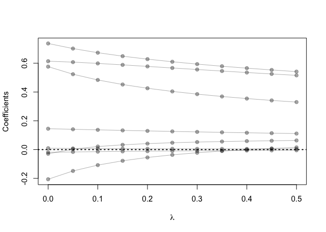

Homework 2
================
Stojsin, Rastko
February 3, 2020

``` r
library('ElemStatLearn')  ## for 'prostate'
library('splines')        ## for 'bs'
library('dplyr')          ## for 'select', 'filter', and others
```

    ## 
    ## Attaching package: 'dplyr'

    ## The following objects are masked from 'package:stats':
    ## 
    ##     filter, lag

    ## The following objects are masked from 'package:base':
    ## 
    ##     intersect, setdiff, setequal, union

``` r
library('magrittr')       ## for '%<>%' operator
library('glmnet')         ## for 'glmnet'
```

    ## Loading required package: Matrix

    ## Loaded glmnet 3.0-1

``` r
## loading prostate data
data('prostate')

## split prostate into testing and training subsets
prostate_train <- prostate %>%
  filter(train == TRUE) %>% 
  select(-train)
prostate_test <- prostate %>%
  filter(train == FALSE) %>% 
  select(-train)

## correlation of all variables in prostate data set
cor(prostate)
```

    ##              lcavol      lweight       age         lbph         svi
    ## lcavol   1.00000000  0.280521386 0.2249999  0.027349703  0.53884500
    ## lweight  0.28052139  1.000000000 0.3479691  0.442264395  0.15538491
    ## age      0.22499988  0.347969112 1.0000000  0.350185896  0.11765804
    ## lbph     0.02734970  0.442264395 0.3501859  1.000000000 -0.08584324
    ## svi      0.53884500  0.155384906 0.1176580 -0.085843238  1.00000000
    ## lcp      0.67531048  0.164537146 0.1276678 -0.006999431  0.67311118
    ## gleason  0.43241706  0.056882099 0.2688916  0.077820447  0.32041222
    ## pgg45    0.43365225  0.107353790 0.2761124  0.078460018  0.45764762
    ## lpsa     0.73446033  0.433319385 0.1695928  0.179809404  0.56621822
    ## train   -0.04654347 -0.009940651 0.1776155 -0.029939957  0.02679950
    ##                  lcp     gleason      pgg45        lpsa        train
    ## lcavol   0.675310484  0.43241706 0.43365225  0.73446033 -0.046543468
    ## lweight  0.164537146  0.05688210 0.10735379  0.43331939 -0.009940651
    ## age      0.127667752  0.26889160 0.27611245  0.16959284  0.177615517
    ## lbph    -0.006999431  0.07782045 0.07846002  0.17980940 -0.029939957
    ## svi      0.673111185  0.32041222 0.45764762  0.56621822  0.026799505
    ## lcp      1.000000000  0.51483006 0.63152825  0.54881317 -0.037427296
    ## gleason  0.514830063  1.00000000 0.75190451  0.36898681 -0.044171456
    ## pgg45    0.631528246  0.75190451 1.00000000  0.42231586  0.100516371
    ## lpsa     0.548813175  0.36898681 0.42231586  1.00000000 -0.033889743
    ## train   -0.037427296 -0.04417146 0.10051637 -0.03388974  1.000000000

``` r
## predict lpsa consider all other predictors
## lm fits using L2 loss
fit <- lm(lpsa ~ ., data=prostate_train)

## functions to compute testing/training error w/lm
L2_loss <- function(y, yhat)
  (y-yhat)^2
error <- function(dat, fit, loss=L2_loss)
  mean(loss(dat$lpsa, predict(fit, newdata=dat)))
```

``` r
## use glmnet to fit lasso
## glmnet fits using penalized L2 loss
## first create an input matrix and output vector
form  <- lpsa ~ 0 + lcavol + lweight + age + lbph + lcp + pgg45 + svi + gleason
x_inp <- model.matrix(form, data=prostate_train)
y_out <- prostate_train$lpsa
fit <- glmnet(x=x_inp, y=y_out, lambda=seq(0.5, 0, -0.05))
print(fit$beta)
```

    ## 8 x 11 sparse Matrix of class "dgCMatrix"

    ##    [[ suppressing 11 column names 's0', 's1', 's2' ... ]]

    ##                                                                        
    ## lcavol  0.307213 0.346981164 0.37816197 0.40661989 0.42282833 0.4390295
    ## lweight .        0.006726359 0.08802058 0.16927550 0.25035001 0.3314244
    ## age     .        .           .          .          .          .        
    ## lbph    .        .           .          .          .          .        
    ## lcp     .        .           .          .          .          .        
    ## pgg45   .        .           .          .          .          .        
    ## svi     .        .           .          0.01374087 0.08859789 0.1634678
    ## gleason .        .           .          .          .          .        
    ##                                                                       
    ## lcavol  0.4531378315 0.457904538 0.462682908  0.470297655  0.576588877
    ## lweight 0.4028215821 0.443064524 0.483362696  0.532139151  0.613933916
    ## age     .            .           .           -0.002937146 -0.019001305
    ## lbph    0.0074401788 0.039872100 0.072288184  0.107605366  0.144879827
    ## lcp     .            .           .            .           -0.206727876
    ## pgg45   0.0001619021 0.001203279 0.002245716  0.003460825  0.009476706
    ## svi     0.2421679543 0.326240708 0.410238393  0.489889125  0.737882527
    ## gleason .            .           .            .           -0.029640502

``` r
## functions to compute testing/training error with glmnet
error <- function(dat, fit, lam, form, loss=L2_loss) {
  x_inp <- model.matrix(form, data=dat)
  y_out <- dat$lpsa
  y_hat <- predict(fit, newx=x_inp, s=lam)  ## see predict.elnet
  mean(loss(y_out, y_hat))
}
```

``` r
## plot path diagram
plot(x=range(fit$lambda),
     y=range(as.matrix(fit$beta)),
     type='n',
     xlab=expression(lambda),
     ylab='Coefficients')
for(i in 1:nrow(fit$beta)) {
  points(x=fit$lambda, y=fit$beta[i,], pch=19, col='#00000055')
  lines(x=fit$lambda, y=fit$beta[i,], col='#00000055')
}
abline(h=0, lty=3, lwd=2)
```

<!-- -->

``` r
## compute training and testing errors as function of lambda
err_train <- sapply(fit$lambda, function(lam) 
  error(prostate_train, fit, lam, form))
err_test <- sapply(fit$lambda, function(lam) 
  error(prostate_test, fit, lam, form))

## plot test/train error
plot(x=range(fit$lambda),
     y=range(c(err_train, err_test)),
     type='n',
     xlab=expression(lambda),
     ylab='train/test error')
points(fit$lambda, err_train, pch=19, type='b', col='darkblue')
points(fit$lambda, err_test, pch=19, type='b', col='darkred')
legend('topleft', c('train','test'), lty=1, pch=19,
       col=c('darkblue','darkred'), bty='n')
```

<!-- -->
